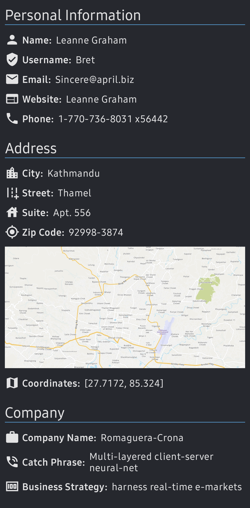
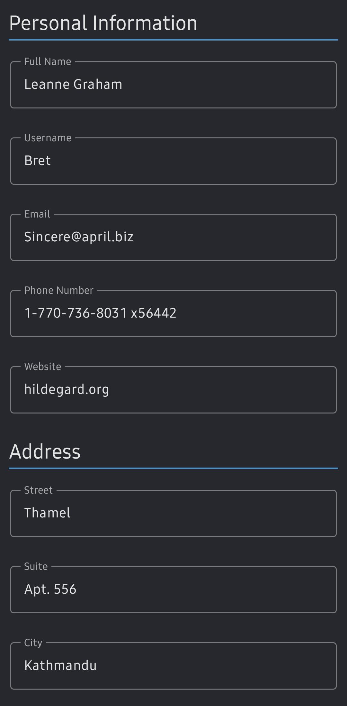
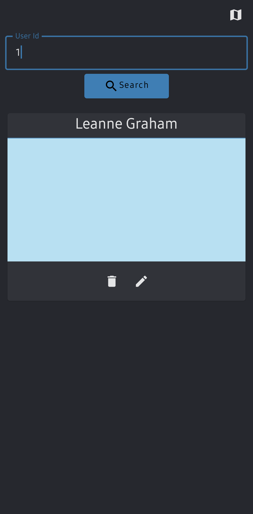

# Graph Maps

Graph map is an application made for android smartphones running on android 10 and above. This app uses a graphQL client called [apollo](https://github.com/apollographql/apollo-kotlin) to create, update, read and delete users. Furthermore this app will also show you a static map of the coordinates you've provided.

## Screenshots

| User Info      | Add User |Home |
| ----------- | ----------- |----------- |
||||
